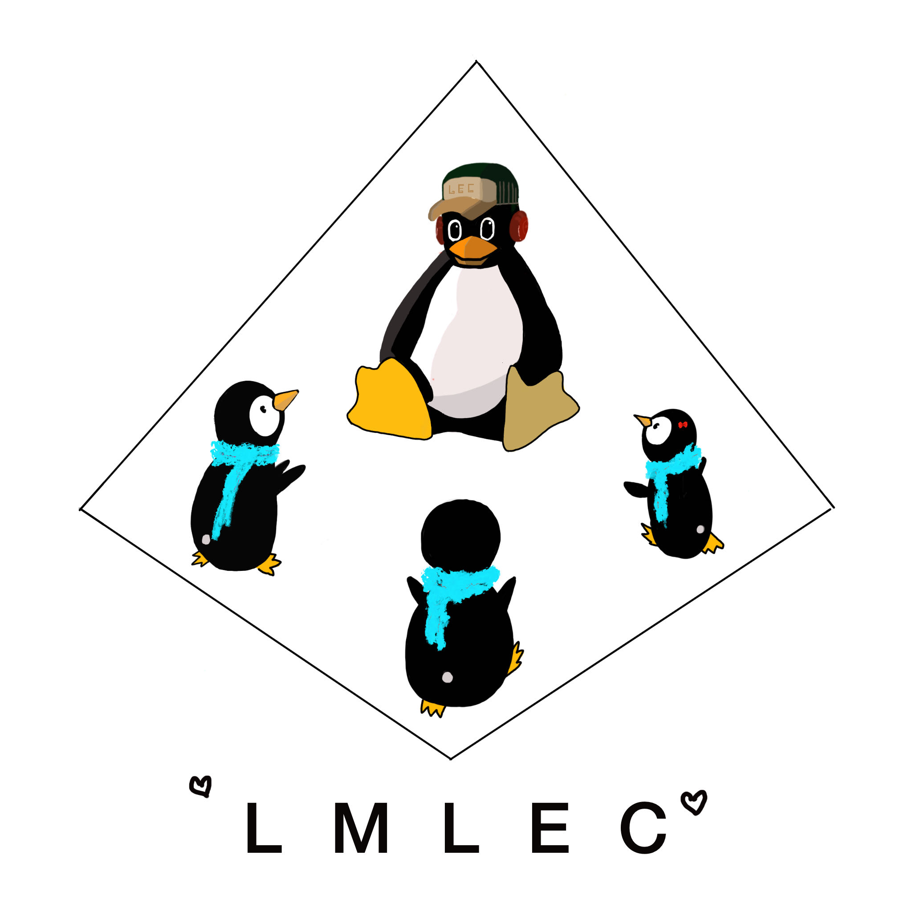

[TOC]

# Linux-for-LEC

熟悉 Linux, 探索 Linux, 受益于 Linux.

Try this Linux mousse cake 🍰.

Help yourself and for LEC 🍻.

## Contents

### Vidio List

[Main entry](https://video.xjtlu.edu.cn/Mediasite/Channel/f02e0faa72b2466b8c99abba5c83033c5f/browse/null/most-recent/null/0/null)

### Sharing Sessions

1. [Linux for LEC](https://video.xjtlu.edu.cn/Mediasite/Channel/f02e0faa72b2466b8c99abba5c83033c5f/watch/f1c9b139179e4f44b095c60a1f82eb291d)

2. [Pop!\_OS Installation](https://video.xjtlu.edu.cn/Mediasite/Channel/f02e0faa72b2466b8c99abba5c83033c5f/watch/e850663dc0884b45896a88f7f54702671d)

3. [VirtualBox 增强安装 Geust Additions](https://video.xjtlu.edu.cn/Mediasite/Channel/f02e0faa72b2466b8c99abba5c83033c5f/watch/014ec24d4ebd4b758801956f7f4073a11d)

4. [Tiling window manager | Play around](https://video.xjtlu.edu.cn/Mediasite/Channel/f02e0faa72b2466b8c99abba5c83033c5f/watch/acbadc70586047ae97abe741689f0acf1d)

5. [中文输入法 | Python 环境配置 | Node 安装 升级 | Things make life better](https://video.xjtlu.edu.cn/Mediasite/Channel/f02e0faa72b2466b8c99abba5c83033c5f/watch/60d7d0c4c9e441b3bbca133daf8694bd1d)

6. [Neovim 安装 | 源码安装](https://video.xjtlu.edu.cn/Mediasite/Channel/f02e0faa72b2466b8c99abba5c83033c5f/watch/49e0c5876a2f44db8f88a49724cf21311d)

## LEC

**Linux Makes your Life Easier**, LEC 旨在通过系统性学习 Linux 操作系统, 将实践与教学相结合以解决应用时出现的问题, 在提升行业能力的同时让参与者更深入地了解编程世界的本质, 为所有人建立一个于新手友好的、学院式的 Linux 社区.

### Contact Us

📧 Mail: lec@xjtlu.edu.cn
